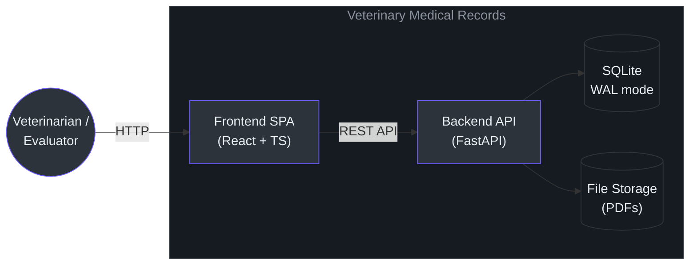
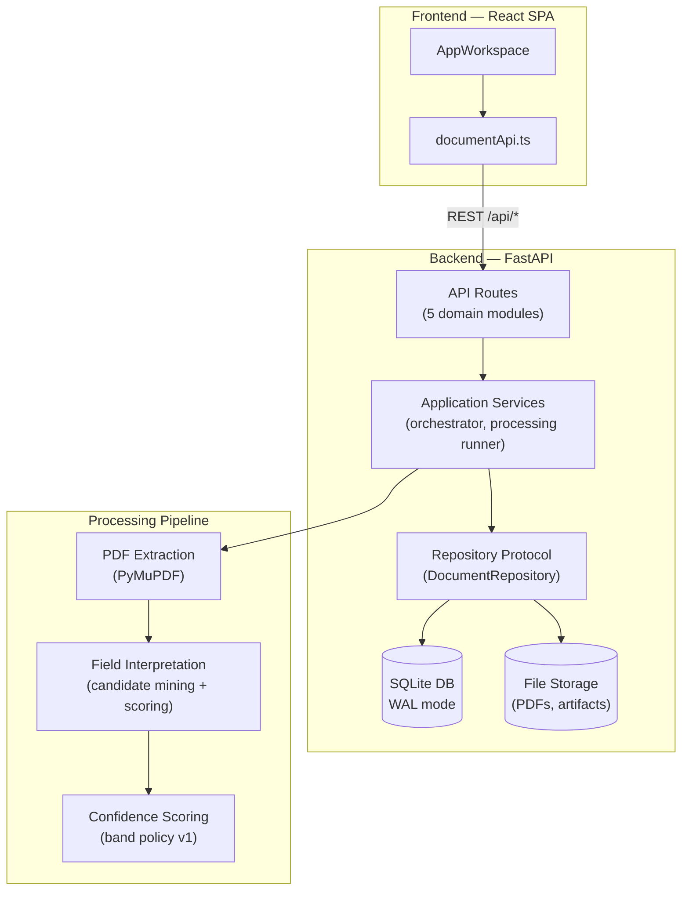
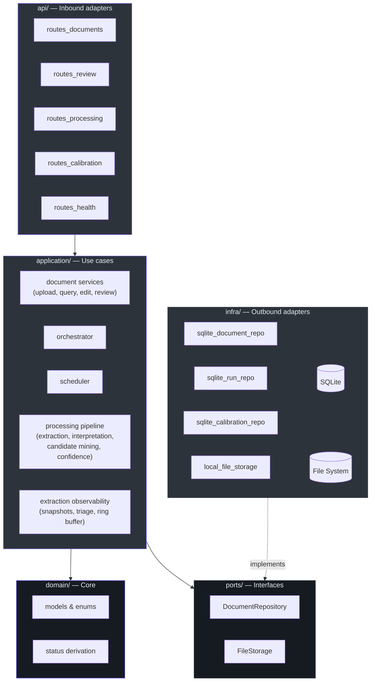

# Architecture Overview

**Breadcrumbs:** [Docs](../../../README.md) / [Projects](../../README.md) / veterinary-medical-records / 02-tech

<!-- START doctoc generated TOC please keep comment here to allow auto update -->
<!-- DON'T EDIT THIS SECTION, INSTEAD RE-RUN doctoc TO UPDATE -->

- [Tech stack](#tech-stack)
- [System diagram](#system-diagram)
- [Key architectural decisions](#key-architectural-decisions)
- [Data flow](#data-flow)
- [Project structure](#project-structure)
- [Quality metrics (post-Iteration 12)](#quality-metrics-post-iteration-12)
- [Related documentation](#related-documentation)

<!-- END doctoc generated TOC please keep comment here to allow auto update -->

> One-page summary for evaluators. For full detail, see [technical-design.md](technical-design.md).

## Tech stack

| Layer        | Technology                               | Why                                                                                     |
| ------------ | ---------------------------------------- | --------------------------------------------------------------------------------------- |
| Frontend     | React 18 + TypeScript 5 + Tailwind CSS 3 | Type-safe SPA with utility-first styling                                                |
| Backend      | Python 3.11 + FastAPI 0.115              | Async-first framework, auto-generated OpenAPI                                           |
| Database     | SQLite (WAL mode)                        | Zero-config, ACID, portable — see [ADR-ARCH-0002](adr/ADR-ARCH-0002-sqlite-database.md) |
| PDF parsing  | PyMuPDF 1.24                             | High-fidelity text extraction with built-in fallback                                    |
| Unit testing | Vitest 4 + Pytest                        | Fast, parallel test runners for both stacks                                             |
| E2E testing  | Playwright 1.58                          | Cross-browser automation with trace/video on failure                                    |
| CI/CD        | GitHub Actions (10 jobs)                 | Path-filtered, cached, cancel-in-progress                                               |
| Containers   | Docker Compose                           | One-command `docker compose up --build`                                                 |

## System context

The system has a single external actor (the veterinarian/evaluator) and two
internal persistence boundaries.



There are no external integrations, message queues, or third-party services.
The system is fully self-contained by design
([ADR-ARCH-0001](adr/ADR-ARCH-0001-modular-monolith.md),
[ADR-ARCH-0004](adr/ADR-ARCH-0004-in-process-async-processing.md)).

## System diagram



## Key architectural decisions

| Decision                     | Rationale                                                         | Record                                                            |
| ---------------------------- | ----------------------------------------------------------------- | ----------------------------------------------------------------- |
| Modular monolith             | Single deploy, clear boundaries, Docker-first                     | [ADR-ARCH-0001](adr/ADR-ARCH-0001-modular-monolith.md)            |
| SQLite as primary DB         | Zero-config, ACID, portable; PostgreSQL migration path documented | [ADR-ARCH-0002](adr/ADR-ARCH-0002-sqlite-database.md)             |
| Raw SQL + repository pattern | Explicit queries, no ORM abstraction leaks                        | [ADR-ARCH-0003](adr/ADR-ARCH-0003-raw-sql-repository-pattern.md)  |
| In-process async processing  | No external queue for MVP; worker profile path documented         | [ADR-ARCH-0004](adr/ADR-ARCH-0004-in-process-async-processing.md) |

## Data flow

1. **Upload** → PDF stored on disk, metadata in SQLite, processing queued in-process
2. **Extract** → Text extraction via PyMuPDF with built-in fallback for edge cases
3. **Interpret** → Field identification via regex + candidate mining + confidence scoring
4. **Review** → Evaluator sees structured fields with confidence indicators, can edit/approve/reprocess

## Project structure

```text
backend/app/
├── api/           → 5 route modules (documents, review, processing, calibration, health)
├── application/   → orchestrator, processing runner, document services, extraction observability
│   └── processing/→ PDF extraction, interpretation, confidence scoring
├── domain/        → entities (models.py), status derivation
├── infra/         → SQLite repos (3 aggregates + façade), file storage
└── ports/         → repository protocols, file storage interface

frontend/src/
├── api/           → documentApi client
├── components/    → workspace/, viewer/, review/, structured/, ui/, app/, toast/
├── constants/     → shared constants
├── extraction/    → candidateSuggestions, fieldValidators
├── hooks/         → 28 production custom hooks for upload, review, rendering, sidebar, filters, and reprocessing flows
├── lib/           → utils, filters, validators
└── types/         → shared TypeScript interfaces
```

## Hexagonal component map

The backend follows a hexagonal (ports-and-adapters) architecture. Dependencies
point inward — outer layers depend on inner layers, never the reverse.



<!-- Sources: backend/app/ directory structure -->

## Quality metrics (post-Iteration 12)

| Metric         | Value                      |
| -------------- | -------------------------- |
| Backend tests  | ~395 (≥91% coverage)       |
| Frontend tests | ~287 (≥87% coverage)       |
| E2E tests      | 65 (21 spec files)         |
| CI jobs        | 10 (path-filtered, ~4 min) |
| Lint errors    | 0                          |

## Production scope boundaries

This system is a **technical assessment project**, not a production deployment.
The following architectural viewpoints are intentionally out of scope. Each
subsection documents the current state and what a production evolution would
require.

### Security (V7) — Out of scope

**Current state:**

- Optional static bearer token via `AUTH_TOKEN` env var (disabled when unset).
- Rate limiting on upload (10/min) and download (30/min) via `slowapi`.
- UUID validation on all path parameters.
- Non-root container execution.
- `pip-audit` and `npm audit` in CI.

**Production path:** OAuth 2.0 / JWT at API gateway, RBAC on endpoints, TLS
termination, STRIDE threat model, per-user quotas, audit logging. The hexagonal
architecture supports this without modifying domain or application layers.

### Operational concerns (V8) — Out of scope

**Current state:**

- 17 structured loggers via `getLogger(__name__)`.
- Health endpoint (`GET /health/ready`) with Docker healthcheck integration.
- Extraction observability ring buffer (20-run history per document).
- Build metadata embedded in image (`APP_VERSION`, `GIT_COMMIT`, `BUILD_DATE`).

**Production path:** Prometheus/OpenTelemetry metrics, structured JSON logging,
SLO definitions (availability, error rate, P95 latency), alerting rules,
operational runbooks (backup, DB maintenance, failure modes).

## Related documentation

- [technical-design.md](technical-design.md) — Full architecture, contracts, state machines (~2K lines)
- [product-design.md](../01-product/product-design.md) — Product intent and semantics
- [ux-design.md](../01-product/ux-design.md) — Interaction contract and confidence UX rules
- [delivery-summary.md](../04-delivery/delivery-summary.md) — Quantitative delivery evidence
- [ADR index](adr/index.md) — All architecture decision records
